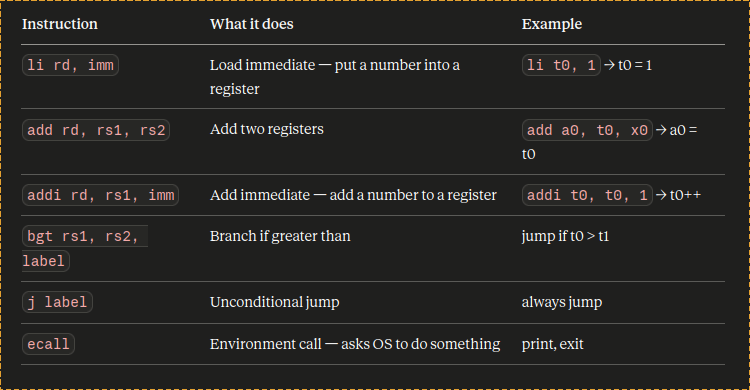

# RISC-V Learning Journal

_Last updated: Fri May 29 2026_

## Phase 1

### 2026-05-26 🔥 — 0.5h

**What I studied / built:**
I read the first chapter of Riscv reader. Installed RARS in `~/Desktop/` from the official github.
Got a `rars.jar` file, run by `java -jar rars.jar`

**What confused me:**
increment and modular ISA

**Next session:**
write an assembly code to print 1-10 using RARS

---

### 2026-05-27 🔥 — 1.5h
**Topics:** RISC-V assembly, Open source contribution

**What I studied / built:**
Wrote the assembly code of 1-10 loop in [1-10_Loop.asm](/phase-2-assembly/code/1-10_Loop.asm)  

Used the following RISCV assembly instructions: 

The assembler set of processes is shown in the video -
[assembler](https://github.com/user-attachments/assets/52587439-ca68-4ed3-9655-200bfd6c5f24) 
 
Also added the contribution guide and create first github issue of this repo.

**What confused me:**
the register usage in each step of assembler

**Next session:**
Will do 3 questions regarding this assembly code. And proceed further

---

### 2026-05-28 🙂 — 0.5h
**Topics:** RISC-V assembly, Open source contribution

**What I studied / built:**
The Three questions regarding the yesterday's loop assembly program.
- Change to print from 1-20 ✅
- Change it to print only even numbers (2,4..10) ✅
- Change it to print in reverse order (10,9...1) ✅

Added notes in [asm.md](./phase-1-foundations/notes/asm.md) and left one Questions and created a issue for that. <b> (Which is now completed)</b>

Main assembly program : [1-10_Loop.asm](./phase-2-assembly/code/1-10_Loop.asm)

**What confused me:**
Printing in reverse

**Next session:**
Proceed with C programming

---

### 2026-05-29 🙂 — 1h
**Topics:** C programming, Reading / textbook

**What I studied / built:**
- main{} function
- Standard library: <studio.h> gives access to functions like `printf`
- `\n` Newline `\t`Tab `\b` Backspace `\"` Double quote `\\` Backslash
-  int, float, long, short, double, char datatypes
- integer division removes fractional part.. but if one is int and other is float.. int converted to float before operation.
- `%d` for int `%f` for float ( `%6d` and `%6.1f`)
- `for` and `while` loop
- magic numbers (#define LOWER 10)
- Text Stream (every character in new line)
- `getchar()` and `putchar()`
- EOF(End Of FIle) with getchar()
- `&&` AND `||` OR
- `==`test for equality `=` assignment operator `if-else` condition
- Arrays
- functions and return statement
- argument passed by value means, temporary variable not original 
- Exception : Array
- pointers used to modify 'caller's variable'
- strings are stored as array of characters terminated by null character `\0`
- no return value function `void`
- Local and Global Variable
- `extern` keyword

**Detailed Notes:** [1.C_Introdution](/phase-1-foundations/notes/textbooks/K&R/1(Tutorial%20Introduction).md)

**What confused me:**
array, char array, extern keyword

**Next session:**
Proceed with topics and practice on today's confusing topics

---
